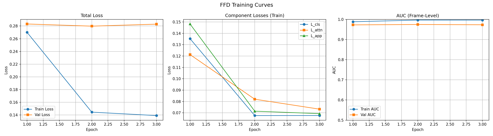
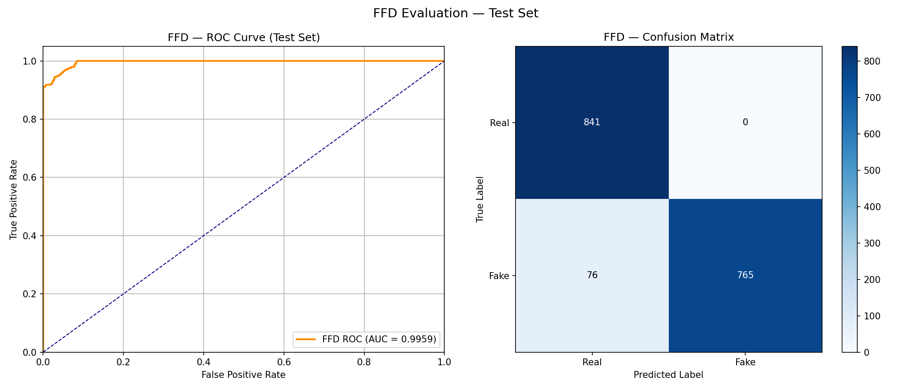
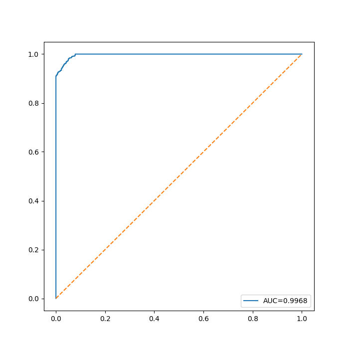
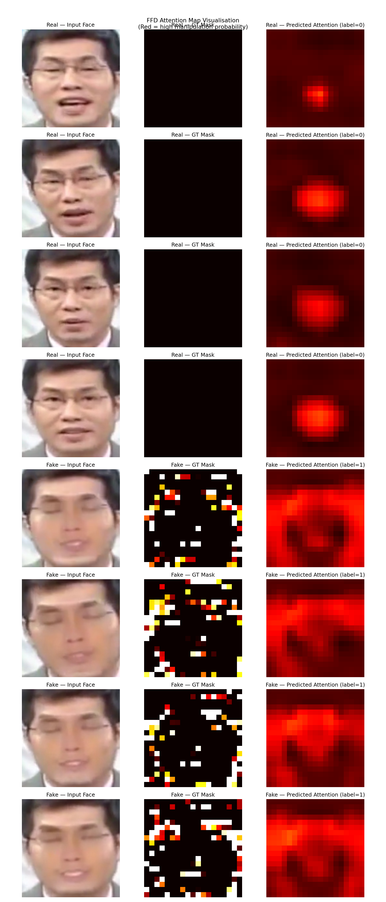
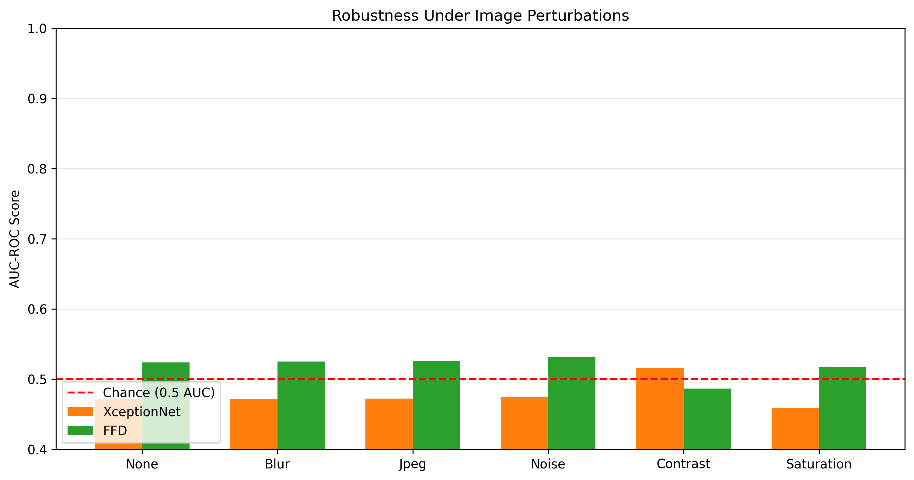
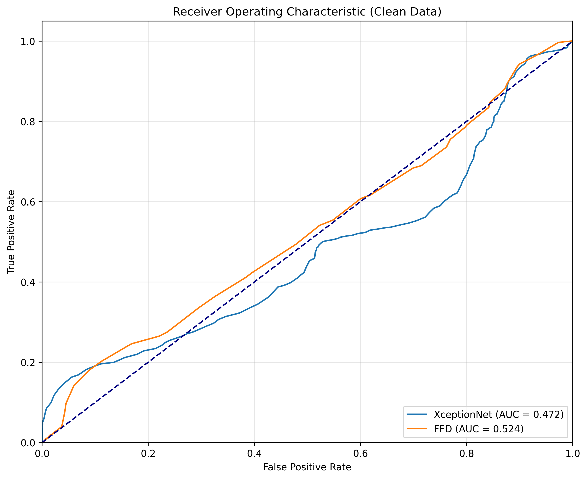

# Face Forgery Detection using Attention-Guided Deepfake Localization

> **Deepfake Detection • FaceForensics++ • PyTorch • XceptionNet •
> Attention Localization**

## Overview

Deepfake generation techniques have advanced rapidly, making manipulated
facial images increasingly difficult to distinguish from authentic ones.
Traditional deepfake detectors often achieve high classification
accuracy but provide little explanation for **why** an image is
predicted as fake.

This repository implements an **Attention-Guided Face Forgery Detection
(FFD)** framework inspired by the CVPR 2020 paper *On the Detection of
Digital Face Manipulation*. Unlike conventional binary classifiers, the
proposed model jointly learns **image classification** and **forgery
localization**, allowing it to identify manipulated facial regions while
simultaneously predicting whether an image is real or fake.

To provide a comprehensive benchmark, the repository also includes an
implementation of **XceptionNet**, one of the most widely used baselines
for deepfake detection. Both models are trained and evaluated on the
**FaceForensics++** dataset and compared using multiple quantitative and
qualitative metrics.

------------------------------------------------------------------------

# Features

-   Attention-guided Face Forgery Detection (FFD)
-   Baseline XceptionNet implementation
-   Complete FaceForensics++ preprocessing pipeline
-   Attention map visualization
-   ROC, Confusion Matrix, Precision, Recall and F1 evaluation
-   Robustness evaluation under image perturbations
-   End-to-end Jupyter notebooks for training and evaluation


# Dataset

The experiments are performed on the **FaceForensics++** dataset.

The preprocessing pipeline includes:

1.  Dataset download
2.  Frame extraction from videos
3.  Face detection and cropping
4.  Image resizing and normalization
5.  Train/Validation/Test split generation

------------------------------------------------------------------------

# Methodology

## 1. Baseline --- XceptionNet

XceptionNet serves as a strong baseline for deepfake detection using
depthwise separable convolutions. The model performs binary
classification (Real/Fake) using Binary Cross Entropy loss.

Although it achieves excellent classification accuracy, it does not
explicitly identify the manipulated facial regions.

------------------------------------------------------------------------

## 2. Face Forgery Detection (FFD)

FFD extends traditional classification by jointly learning:

-   Image classification
-   Manipulation localization

An auxiliary attention branch predicts a manipulation probability map
while the classification branch predicts the image label.

The overall optimization objective is

``` math
L = L_cls + λ₁L_attn + λ₂L_app
```

where:

-   **L_cls** : Classification Loss
-   **L_attn** : Attention Supervision Loss
-   **L_app** : Appearance Consistency Loss

This multi-task formulation encourages the network to focus on
manipulated regions instead of relying on background artifacts.

------------------------------------------------------------------------

# Project Pipeline

``` text
FaceForensics++ Videos
        │
        ▼
Frame Extraction
        │
        ▼
Face Detection & Cropping
        │
        ▼
Image Preprocessing
        │
        ▼
Model Training
   ┌──────────────┐
   │ XceptionNet  │
   └──────────────┘
          │
   ┌──────────────┐
   │ FFD Model    │
   │ + Attention  │
   └──────────────┘
          │
          ▼
Performance Evaluation
          │
          ▼
Benchmarking & Robustness Analysis
```

------------------------------------------------------------------------

# Training Performance

> Place the following figure in `Results/ffd_training_curves.png`

``` markdown
<p align="center">

</p>
```

Training observations:

-   Training loss decreases consistently.
-   Validation loss remains stable, indicating limited overfitting.
-   Classification, attention, and appearance losses all converge.
-   Frame-level AUC remains above **0.97** throughout training.

------------------------------------------------------------------------

# Test Set Evaluation

``` markdown
<p align="center">

</p>
```

### Test ROC-AUC

**0.9959**

### Confusion Matrix

  Actual     Predicted Real   Predicted Fake
  -------- ---------------- ----------------
  Real                  841                0
  Fake                   76              765

The model correctly classifies all real images while detecting the vast
majority of manipulated images.

------------------------------------------------------------------------

# Baseline Performance (XceptionNet)

``` markdown
<p align="center">

</p>
```

  Metric         Value
  ----------- --------
  Accuracy      95.78%
  Precision     98.73%
  Recall        92.75%
  F1 Score      95.65%
  ROC-AUC       0.9968

------------------------------------------------------------------------

# Attention Map Visualization

``` markdown
<p align="center">

</p>
```

The attention branch highlights regions likely to contain manipulations.

For **real images**, the predicted attention maps exhibit minimal
activation, indicating the absence of forged regions.

For **fake images**, high attention is concentrated around manipulated
facial areas, demonstrating that the model learns meaningful forensic
cues rather than relying solely on global appearance.

------------------------------------------------------------------------

# Robustness Analysis

``` markdown
<p align="center">

</p>
```

Both models were evaluated under common image perturbations:

-   Gaussian Blur
-   JPEG Compression
-   Additive Noise
-   Contrast Adjustment
-   Saturation Variation

FFD maintains competitive performance under most perturbations,
suggesting improved robustness and better generalization.

------------------------------------------------------------------------

# ROC Comparison

``` markdown
<p align="center">

</p>
```

The ROC comparison demonstrates that while both approaches achieve
excellent discrimination capability, FFD additionally provides
interpretable localization maps, making it more suitable for explainable
digital image forensics.

------------------------------------------------------------------------

# Installation

``` bash
git clone https://github.com/<your-username>/Deepfake-Detection.git
cd Deepfake-Detection

pip install torch torchvision timm opencv-python pandas numpy matplotlib scikit-learn
```

------------------------------------------------------------------------

# Running the Project

1.  Run **Dataset_download.ipynb**
2.  Execute **Data_preprocessing.ipynb**
3.  Train the baseline using **Xception_model.ipynb**
4.  Train the proposed model using **FFD_Model.ipynb**
5.  Reproduce all evaluation plots using
    **Benchmarking_Evaluation.ipynb**

------------------------------------------------------------------------

# Results Summary

  Model           Accuracy   ROC-AUC  Manipulation Localization
  ------------- ---------- --------- ---------------------------
  XceptionNet       95.78%    0.9968             ❌
  FFD                \~96%    0.9959             ✅

Although both models achieve excellent classification performance, FFD
provides an additional level of interpretability by highlighting
manipulated regions through attention maps.

------------------------------------------------------------------------

# Future Work

-   Vision Transformer based detector
-   Video-level temporal consistency
-   Cross-dataset evaluation
-   Generalization to unseen manipulation techniques
-   Explainable AI methods (Grad-CAM, Integrated Gradients)
-   Real-time deployment

------------------------------------------------------------------------

# References

1.  Dang et al., *On the Detection of Digital Face Manipulation*, CVPR
    2020.
2.  FaceForensics++: Learning to Detect Manipulated Facial Images.
3.  François Chollet, *Xception: Deep Learning with Depthwise Separable
    Convolutions*.

------------------------------------------------------------------------

# Authors

**Subhajit Khan, Samarth jain, Mansihsa Rathod, Diya Gupta, Neha Liladhar Bedke**\

Indian Institute of Technology Kanpur
